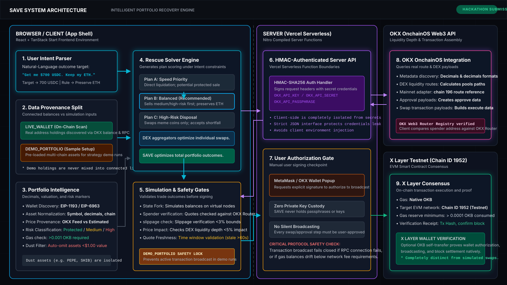

# SAVE

An intent-driven AI portfolio rescue engine.

[Live Production Demo](https://prosave.vercel.app)

SAVE is a Web3 intelligence product that helps users protect and restructure their assets during times of market volatility or personal security breaches. Instead of forcing users to guess which routes, slippage, and swap configurations are safest, SAVE takes a natural language intent (e.g., *"Get me $700 USDC. Don't sell my ETH unless necessary"*), analyzes their entire portfolio across multiple chains, optimizes the execution sequence, and guides them through safe, simulated on-chain actions.

---

## The Problem

During sudden market volatility or network uncertainty, crypto users often know the high-level financial outcome they need, but struggle to calculate the safest sequence of on-chain operations. 

Common user goals:
* *"I need $700 USDC to cover a margin call immediately."*
* *"Protect my long-term ETH holdings at all costs."*
* *"Reduce my exposure to high-risk meme coins by 50%."*
* *"Move my assets toward safer, stable holdings."*

To execute this manually, a user must inspect and calculate:
1. **Asset Balances**: Where are the assets held and across which chains?
2. **Liquidity Depth**: Which DEX pools have enough depth to avoid high price impact?
3. **Slippage & Gas**: What are the current slippage tolerances and native gas fees?
4. **Safety Verification**: Which smart contracts are verified, and what spenders have approvals?
5. **Asset Protection**: How to prevent selling protected assets when other options exist.

DEX aggregators solve routing for individual swaps, but they do not solve the portfolio-level decision problem. SAVE bridge the gap between user intent and multi-step portfolio recovery.

---

## What SAVE Does

SAVE guides users through a highly visual, structured recovery journey:

```
[Connect Wallet]
       │
       ▼
[Discover Portfolio]  ───> Scan balances & risk flags natively
       │
       ▼
[Parse Intent]        ───> Extract goals & asset protection rules using AI
       │
       ▼
[Solve Rescue]        ───> Calculate 3 distinct, scored execution plans
       │
       ▼
[Simulate Closed]     ───> Evaluate gas, slippage, and price impact against forked state
       │
       ▼
[Authorize Recovery]  ───> User signs sequentially; zero automatic broadcast
```

---

## Why SAVE Is Different

| DEX Aggregators | SAVE Portfolio Rescue |
| :--- | :--- |
| Optimize a single token pair route | Optimizes the entire portfolio outcome |
| Focus on exchange rates (`ETH ──> USDC`) | Preserves protected assets while hitting dollar targets |
| Blind to portfolio-level asset constraints | Scores routes based on overall risk reduction and asset preservation |
| Require manual multi-transaction setups | Sequences approvals and swaps automatically |

---

## Example

### Input Intent
> *"Get me $700 USDC. Don't sell my ETH unless necessary."*

When evaluated, SAVE's solver generates three distinct strategies:
* **Plan A (Speed Priority)**: Liquidates assets directly to reach the target, potentially selling a portion of protected assets if high-risk assets are insufficient.
* **Plan B (Balanced Outcome - Recommended)**: Sells medium and high-risk assets first, keeping the protected ETH reserve untouched by checking secondary liquidity pools.
* **Plan C (High-Risk Disposal)**: Restricts liquidations strictly to meme coins/volatile tokens, accepting minor shortfall if the target cannot be reached without touching protected assets.

*Note: For testing complex strategies with diverse token balances, judges can use the explicit **Demo Portfolio** toggle to load sample assets (e.g. ETH, PEPE, TKX) and inspect calculated execution routes.*

---

## Live vs Demo Data

To maintain absolute trust and transparency, SAVE enforces strict data mode boundaries:
* **`LIVE_WALLET`**: Populated strictly by the active connected EIP-1193 wallet address. It queries the local RPC client and the OKX balance API. If your wallet holds only native OKB, only OKB will be shown.
* **`DEMO_PORTFOLIO`**: An explicit sample portfolio containing diverse assets, risk categories, and multi-chain positions used to demonstrate complex recovery scenarios.

Demo assets are kept completely separate and are **never** mixed into live connected wallet balances.

---

## Architecture



SAVE separates portfolio reasoning from execution infrastructure. The rescue solver determines the portfolio-level strategy, OKX provides route and transaction intelligence, and X Layer provides the user-authorized execution and verification environment.

* **Wallet Connectivity (EIP-1193 / EIP-6963)**: Passive discovery of injected browser wallet providers (MetaMask, OKX Wallet) and Reown/WalletConnect connectivity.
* **Portfolio Intelligence**: Scans native and ERC-20 balances, flags contract risk levels, and normalizes holdings.
* **Intent Parser**: Normalizes natural language queries into goal amounts, target symbols, and protected assets.
* **Rescue Solver**: An algorithmic solver that optimizes liquidation paths, calculates SAVE quality scores, and generates diverse candidate plans.
* **OKX OnchainOS Integration**: Queries token lists, retrieves real-time pricing/quotes, and prepares raw transaction payloads.
* **Simulation Engine**: Evaluates prepared transactions against a simulated forked state to verify output outcomes, gas costs, and price impact before signing.
* **X Layer Execution Proof**: A lightweight, live on-chain execution target proving wallet sign-and-broadcast capabilities on-chain.

---

## OKX OnchainOS Integration

SAVE natively integrates with OKX Web3 APIs to query live market states and prepare transactions:
* **Token Discovery**: Normalizes multi-chain tokens across Ethereum, Arbitrum, Base, Polygon, and X Layer.
* **DEX Routing & Quotes**: Retrieves executable quotes and swap parameters.
* **Transaction Preparation**: Requests raw transaction data (swaps, approvals) via authenticated server-side endpoints using HMAC-SHA256 signature verification to protect client keys.

> **Execution Division**: OKX OnchainOS provides raw liquidity and routing intelligence. SAVE acts as the brain that decides *which* combinations of trades satisfy the overall portfolio constraints.

---

## X Layer Integration

SAVE is optimized for **X Layer (Chain ID 1952)**:
* **Native gas**: Reads native OKB balances via X Layer RPC to ensure users hold sufficient gas before launching a rescue plan.
* **Wallet network verification**: Checks and prompts the user to switch networks if they are connected to an unsupported chain.
* **Live on-chain execution proof**: Users can trigger a live transaction (a micro-transfer of native OKB) to prove the sign-and-broadcast pipeline, block confirmations, and gas usage under real conditions.

*Note: The live proof transaction is kept strictly separate from the simulated $700 rescue plan to prevent users from executing unverified trades during testing.*

---

## Live Execution Proof

SAVE has successfully demonstrated a complete live verification flow:
1. Connected MetaMask / OKX Wallet to the application.
2. Verified active chain index (1952) and gas thresholds.
3. Triggered authorization prompt.
4. User signed and broadcast the transaction via MetaMask/OKX Wallet to the X Layer Testnet.
5. Polled receipt block confirmations using the RPC client.
6. Displayed final gas used, block number, and refreshed balances.

---

## Safety & Controls

* **Non-Custodial**: SAVE never asks for private keys or seed phrases. All transactions must be authorized and signed by the user's wallet.
* **No Automatic Broadcast**: Prepared transaction payloads are returned to the client and require manual approval.
* **Gas Reserve Check**: Blocks execution if the wallet does not have enough native OKB to cover simulated network fees.
* **Protected Asset Locks**: Enforces strict protection rules, preventing transaction preparation if a user's strategy violates their active intent settings.
* **Spender Verification**: Verifies approval contracts against official OKX Router registry addresses.
* **Demo Execution Lock**: Disables all live broadcast and signature calls when running inside `DEMO_PORTFOLIO` mode.

---

## Tech Stack

* **Frontend**: React, TanStack Start (SSR/Vite framework)
* **Language**: TypeScript
* **Styling**: Vanilla CSS (Tailwind-free premium dark mode layout)
* **Web3 Integration**: Viem, EIP-1193, EIP-6963 provider discovery
* **Web3 APIs**: OKX OnchainOS Web3 API, OKX DEX API
* **Deployment & Hosting**: Vercel (Edge Functions + SSR configuration)
* **Testing & Tools**: Bun test runner

---

## Run Locally

### 1. Clone the repository
```bash
git clone https://github.com/YakiUdoph/prosave.git
cd SAVE-XLayer
```

### 2. Configure environment variables
Create a `.env` file in the root directory:
```env
VITE_WALLETCONNECT_PROJECT_ID=your_walletconnect_project_id
OKX_API_KEY=your_okx_api_key
OKX_API_SECRET=your_okx_secret
OKX_API_PASSPHRASE=your_okx_passphrase
OKX_API_PROJECT_ID=your_okx_project_id
```

### 3. Install dependencies and run development server
```bash
bun install
bun run dev
```
Open `http://localhost:3000` in your browser.

---

## Tests

SAVE maintains a comprehensive unit and integration test suite:
* `tests/data-honesty.test.ts`: Verifies mode isolation, sparse wallet filtering, and execution safety gates.
* `tests/okx-integration.test.ts`: Verifies server-side HMAC authorization, quotes, and pricing feeds.
* `tests/rescue-solver.test.ts`: Validates plan score math, gas limits, and diversity algorithms.
* `tests/simulation.test.ts`: Verifies state-gate transition logic and transaction validation checks.

Run tests:
```bash
bun test
```

---

## Product Vision

The hackathon version of SAVE demonstrates the core execution layer of a broader portfolio intelligence engine. Future extensions include:
* **Cross-Chain Rescue**: Automatically bridges rescued stablecoins back to a safe vault on a secondary network (e.g. X Layer to Arbitrum).
* **Derivatives Hedging**: Automatically opens delta-neutral hedges on OKX Perpetual DEX when assets cannot be easily swapped due to extreme price impact.
* **RWA Integration**: Allows locking high-yield real-world assets (RWA) into vault parameters to serve as emergency collateral during credit events.
* **Automated Policy Monitoring**: A passive guardian bot that alerts users to execute a SAVE plan when predefined threat triggers are breached.
