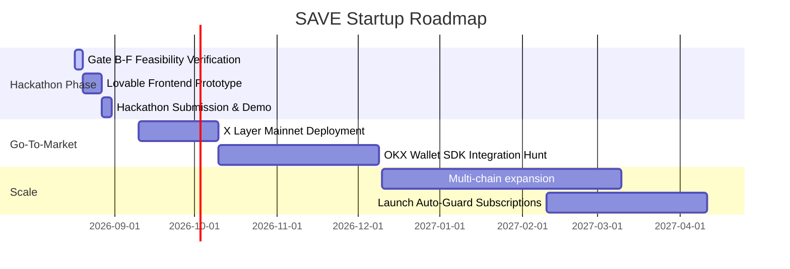
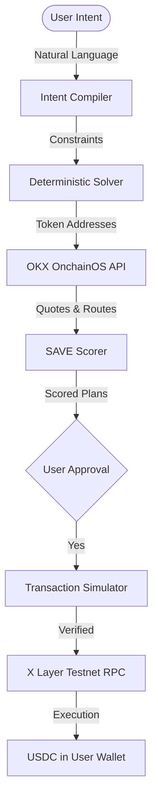

# Product Requirements Document (PRD)
## SAVE — AI Exit & Liquidity Engine on X Layer

SAVE is an intent-based, risk-aware exit and liquidity engine designed to help Web3 users protect their capital, optimize exit routes during volatility, and execute complex asset rescues in a single click.

---

## 📖 1. Executive Summary & Vision

### The 1-Sentence Pitch
> **"An AI agent that watches your crypto positions and helps you exit safely before losses become worse."**

### Pitch Matrix
*   **Short Pitch**: SAVE is an intelligent safety button for your Web3 portfolio. It continually scans your on-chain assets, evaluates market risk, and generates optimized, single-click liquidation routes to secure your target funds while safeguarding your high-conviction tokens.
*   **Long Pitch**: SAVE is the first intent-based liquidation copilot built on X Layer. By combining real-time portfolio diagnostics, deterministic multi-route scoring, and a natural-language intent compiler, SAVE solves the Web3 exit crisis. Users express simple safety goals—such as "get me 700 USDC while protecting my ETH"—and SAVE continuously simulates, scores, and executes the optimal path through the OKX OnchainOS.
*   **Hackathon Judge Pitch**: Judges, in the last market crash, billions of dollars were lost not because users didn't want to exit, but because exiting required manual routing, navigating fragmented pools, and fighting gas wars under extreme panic. We built SAVE: an AI Exit & Liquidity Engine on X Layer. In one click, a user can rescue their capital using a deterministic solver that routes swaps through the OKX OnchainOS, simulates transactions to prevent reverts, and respects user-defined asset protections. We have successfully verified this engine against the live X Layer Testnet.
*   **Investor Pitch**: The Web3 liquidity landscape is highly fragmented and volatile. During market downturns, retail users lose up to 15% of their portfolio to front-running, high price impact, and misconfigured slippage. SAVE is a category-defining AI Liquidity Agent. By automating risk assessment and exit routing, we convert panic-selling into structured, optimized de-risking events. Operating on X Layer and integrating with OKX Web3 APIs, we target millions of active wallet holders. We are raising our pre-seed round to transition this verified engine into a production-ready application.

---

## ⚠️ 2. Core Problem & Market Pain

### Who has this problem?
-   **Active DeFi Yield Farmers**: Users holding multiple volatile reward tokens across various yield pools.
-   **Retail Altcoin Traders**: Users with high exposure to low-liquidity meme or utility tokens.
-   **Liquidity Providers (LPs)**: Users exposed to impermanent loss who need to withdraw and exit rapidly.
-   **Long-Term Accumulators**: Investors holding core assets (like ETH or OKB) who trade altcoins but want to protect their core holdings during market drawdowns.

### When does this problem happen?
-   **Market crashes and capitulations**: Fast price drops where every second of delay leads to further losses.
-   **Protocol hacks or de-pegging events**: Sudden panic where liquidity pools drain rapidly.
-   **Liquidity crunch**: Low depth in primary pools causing massive price impact during manual swaps.

### Why do existing solutions fail?
1.  **DEX Aggregators**: Only answer *how* to swap (routing), not *what* or *when* to swap. They require manual, token-by-token selection, which is slow and prone to error during a panic.
2.  **Trading Bots**: Execute simple price triggers (e.g. stop-loss) but lack multi-asset portfolio awareness and cannot handle soft constraints (like protecting specific assets).
3.  **Risk Dashboards**: Only display portfolio losses in real-time but offer no integrated execution tools to resolve the risk.

### Why does this require an AI Risk Agent?
-   Volatile markets present non-linear risks. Price impact, gas fees, and liquidity routes change in milliseconds. 
-   Humans cannot calculate the mathematically optimal combination of swaps to yield exactly `$700 USDC` while minimizing fees and preserving selected tokens under stress.
-   The AI Agent processes natural language intents, translates them into deterministic solver constraints, continuously fetches real-time rates via the OKX API, and presents the optimal execution plan.

---

## 👥 3. User Personas

### Persona 1: Max — The Active DeFi Yield Farmer
-   **Background**: Farms yields across multiple protocols on X Layer. Holds volatile reward tokens like ELF, QUICK, and various ecosystem assets.
-   **Problem**: He cannot monitor the market 24/7. When reward tokens start to dump, he loses his accrued yield before he can manually swap them.
-   **Current Solution**: Manually monitors prices on DexScreener and swaps tokens one-by-one on AMMs.
-   **Why SAVE Helps**: SAVE continuously monitors his portfolio risk. With a single click, Max can authorize SAVE to exit 70% of his volatile rewards to USDC, securing his yield while keeping 30% for potential upside.

### Persona 2: Sarah — The Long-Term Accumulator
-   **Background**: Holds a core long-term ETH position on X Layer. She trades smaller altcoins with a portion of her portfolio.
-   **Problem**: She needs to raise 700 USDC to cover an on-chain loan margin call during a sudden market downturn, but wants to keep her ETH unless absolutely necessary.
-   **Current Solution**: Manually checks her altcoin balances, calculates the values, swaps them individually, and ends up selling some ETH because of bad math.
-   **Why SAVE Helps**: Sarah inputs: "Get me 700 USDC, protect ETH". SAVE’s solver prioritizes liquidating her altcoins first and only touches a minimal fraction of her ETH when the altcoins are insufficient.

### Persona 3: Liam — The Gas-Conscious Retail Trader
-   **Background**: Trades ecosystem tokens on L2s with smaller capital sizes ($1,000–$2,000 total).
-   **Problem**: When exiting multiple positions, multiple transaction fees and slippage eat up 10%+ of his remaining funds.
-   **Current Solution**: Uses standard swap interfaces individually, accepting high slippage.
-   **Why SAVE Helps**: SAVE evaluates and compares multiple routes, routing him through the most gas-efficient single-hop path via OKX OnchainOS, saving him gas fees and transaction costs.

---

## 🗺️ 4. Complete User Journey

| Step | User Sees | User Feels | Technical Requirement | Why it Matters |
| :--- | :--- | :--- | :--- | :--- |
| **1. Discovery** | Sleek landing page explaining the "Safe Button" concept for X Layer. | Intrigued, hopeful, secure. | Static HTML/CSS. | Explains the product value proposition instantly. |
| **2. Connect** | One-click OKX Web3 Wallet connection screen. | Connected and in control. | `viem` / wallet standard provider detection. | Safe, trustless onboarding. |
| **3. Scan** | A dynamic visual scan of their portfolio assets and values. | Aware of their asset exposure. | JSON-RPC balance queries via X Layer Testnet. | Shows the user their actual on-chain starting state. |
| **4. Analysis** | Volatility scores and risk flags highlighted next to each asset. | Informed about which assets are risky. | Volatility calculation rule engine. | Educates the user on why action is recommended. |
| **5. Plan** | Natural language input (e.g., "Rescue $700") generating route recommendations. | Relieved; the path to safety is clear. | Deterministic solver & OKX OnchainOS API call. | Translates goals into concrete math-driven options. |
| **6. Simulate** | Reassurance that the transaction will succeed (gas check & path validation). | Safe; no fear of failed transactions. | `eth_simulate` / dry-run execution checks. | Guarantees the transaction won't revert on-chain. |
| **7. Approve** | Clear confirmation showing: output, gas cost, slippage, and SAVE Score. | Empowered to execute. | Signature request preparation. | Maintains absolute user custody (no auto-trading without consent). |
| **8. Execute** | Live progress bar showing routing status and TX confirmations. | Excited; watching the rescue happen. | Broadcast transaction & verify receipts via RPC. | Safe transaction execution. |
| **9. Report** | After-action summary of saved funds, gas spent, and protected assets. | Satisfied, victorious. | Saved tx logs & state comparison. | Proves the value delivered by SAVE. |

---

## 🎬 5. Winning Demo Story

### Before SAVE
Max is asleep. It is 3:00 AM. A sudden market selloff begins. Max's $1,000 portfolio consisting of volatile reward tokens ($700) and native ETH ($300) begins dropping. He has a $700 margin payment due on a lending protocol in 15 minutes.

### The Problem Moment
Max wakes up to an alert. He panics. He opens a DEX aggregator to swap his reward tokens to USDC. Under stress, he copies the wrong token address. The transaction fails due to high gas volatility, costing him $15 in wasted gas. The market drops another 8%. He faces liquidation on his loan. He doesn't want to sell his long-term ETH, but he doesn't know how to swap the other tokens fast enough.

### The SAVE Intervention
Max opens SAVE. He connects his OKX Web3 Wallet. The interface immediately runs a risk scan, flaggin his altcoins as high-risk. 
Max types: **"Rescue 700 USDC. Protect ETH."**
SAVE's solver immediately generates a plan:
*   Liquidate all volatile reward tokens.
*   Retain 100% of his protected ETH.
*   Route the swap via OKX DEX Aggregator.
*   SAVE Score: **96/100** (Optimal).
Max reviews the plan, sees that his ETH is untouched, and clicks "Approve".

### The Result
SAVE simulates the transaction (Status: SUCCESS) and broadcasts the swaps. Within 12 seconds, Max receives exactly `703.34 USDC` in his wallet. His loan is saved from liquidation, and his ETH remains fully intact. The after-action report shows he saved $42 in slippage and avoided $20 in failed transaction fees. Max breathes a sigh of relief.

---

## ⚖️ 6. Competitive Differentiation

| Feature | DEX Aggregators (e.g. 1inch) | Trading Bots (e.g. Banana Gun) | Portfolio Trackers (e.g. DeBank) | SAVE Engine |
| :--- | :--- | :--- | :--- | :--- |
| **Goal Input** | None (Token A to B only) | None (Simple triggers) | None (View only) | **Natural Language Intents** |
| **Asset Protection**| No | No | No | **Yes (Soft constraints)** |
| **Risk Diagnostics**| No | No | Basic | **Yes (Active risk rules)** |
| **Simulation Guard**| No (Manual check) | Basic | No | **Yes (Multi-hop simulation)** |
| **Core Category** | Transaction Router | Execution Bot | Portfolio Viewer | **Intent Exit Engine** |

---

## 🌐 7. X Layer Ecosystem Alignment

### Why X Layer needs SAVE
As OKX’s L2 network, X Layer is designed to onboard millions of users from the exchange to on-chain Web3. These users require consumer-grade safety tools. SAVE acts as an on-chain safety net, reducing user fear of DeFi complexity and capital loss.

### Driving Ecosystem Activity
-   **Swap Volume**: Every rescue plan routes transactions directly through X Layer DEXs (e.g. ElfomoFi, QuickSwap).
-   **Integration with OKX Infrastructure**: SAVE uses the OKX OnchainOS API for price discovery and liquidity routing, showcasing the power of OKX's developer infrastructure.
-   **Retention**: Users are more likely to keep assets on-chain if they know they can exit to stables safely in one click.

---

## 💰 8. Monetization & Startup Roadmap

### Revenue Models
1.  **Safety Execution Fee**: A minor 0.1% fee charged on the total value of assets successfully rescued.
2.  **Premium Active Guard**: A $9/month subscription for active portfolio monitoring, custom risk alerts (Telegram/SMS), and pre-approved auto-exit triggers.
3.  **B2B Wallet SDK**: Licensing the deterministic exit solver to Web3 wallets (like OKX Web3 Wallet) to offer a native "Safe Exit" button inside their interface.

### 12-Month Startup Roadmap

---

## 🎨 9. Frontend Requirements for Lovable

The frontend should be clean, modern, and highly visual. It must look premium and build trust.

### Page 1: Landing Page
-   **Purpose**: Introduce the SAVE "Safety Button" concept.
-   **Main Elements**: Hero text, "Protect Wallet" CTA button, a simulated preview of the rescue interface, trust badges.
-   **Animations**: Floating secure shield graphic, typing animation for sample intents (e.g., "Rescue 500 USDC").
-   **Interaction**: User clicks the CTA to navigate to the wallet connection screen.

### Page 2: Wallet Connection
-   **Purpose**: Authenticate user via OKX Web3 Wallet.
-   **Main Elements**: Wallet option cards, terms of service agreement, connection state loading spinner.
-   **Animations**: Smooth fade-in of wallet options, pulsing connection indicator.
-   **Interaction**: User approves wallet connection popup.

### Page 3: Portfolio Health Dashboard
-   **Purpose**: Display active token balances, volatility indexes, and general portfolio risk scores.
-   **Main Elements**: Total Portfolio Value (USD), asset allocation pie chart, Risk Level meter (Safe/Warning/Danger), list of individual assets with volatility badges.
-   **Animations**: Chart rendering transitions, color changes of the risk meter based on volatility.
-   **Interaction**: User clicks "Initiate Altcoin Rescue" or enters a custom rescue target.

### Page 4: Rescue Recommendation (Interactive Solver Interface)
-   **Purpose**: Input goals, set protected assets, and review generated routes.
-   **Main Elements**: Intent input box, Protected Asset selection checklist, Route Option comparison cards, calculated SAVE Score display (0-100).
-   **Animations**: Dynamic updating of the SAVE Score card when checking/unchecking protected assets.
-   **Interaction**: Select Route A/B/C, adjust slippage tolerence, click "Simulate Rescue".

### Page 5: Simulation & Verification
-   **Purpose**: Run dry-run execution checks to guarantee transaction success.
-   **Main Elements**: Code simulation console output (mocked or dry-run logs), gas validation progress bars, "Simulation Verified" status indicator.
-   **Animations**: Pulsing green checkmarks, rolling code logs.
-   **Interaction**: Click "Proceed to Execution".

### Page 6: Execution Confirmation (State Machine Interface)
-   **Purpose**: Execute transaction securely.
-   **Main Elements**: Transaction summary, "Approve Transaction in Wallet" prompt, transaction progress bar.
-   **Animations**: Secure lock icon animation, progress loading indicator.
-   **Interaction**: Wallet signature approval trigger.

### Page 7: After-Action Report
-   **Purpose**: Show transaction success details.
-   **Main Elements**: Total USDC rescued, list of protected assets saved, gas spent, slippage savings compared to manual swaps.
-   **Animations**: Confetti effect on success, slide-in details list.
-   **Interaction**: Click "Back to Dashboard" or share report summary.

---

## 🛠️ 10. Technical Architecture Summary

-   **Chain**: X Layer Testnet (Chain ID 1952) / X Layer Mainnet (Chain ID 196).
-   **Provider API**: OKX Web3 DEX Aggregator API (OnchainOS).
-   **RPC Clients**: Viem with automatic latency-based fallback.
