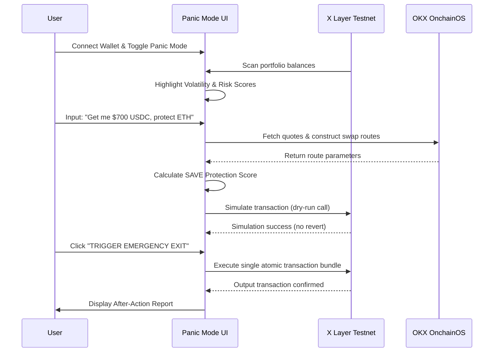

# Product Requirements Document (PRD) — V2
## SAVE: Emergency Exit Intelligence for Web3

SAVE is a premium, non-custodial emergency exit engine on X Layer (Chain ID 1952/196). It acts as an on-chain "panic button," allowing users to express natural-language exit targets (e.g., "Get me $700 USDC, protect ETH") and instantly execute optimized, simulation-guaranteed liquidations via the OKX OnchainOS during market crashes.

---

## 🎨 1. Design & Aesthetic Guidelines

To build trust and create high impact during a demo, the user interface must blend three core design philosophies:

1.  **Apple Emergency Interface**: Minimalist, high contrast, clean typography (SF Pro), and absolute clarity. When in danger, cognitive load must be zero. Warnings must look like system-level iOS critical alerts.
2.  **Bloomberg Terminal**: Real-time telemetry, dense but structured data, crisp percentage updates, active simulation logs, and dark carbon color palettes with highly intentional crimson and safety green highlights.
3.  **OKX Wallet Native Experience**: Seamless integration, utilizing standard web3 connection states, border radiuses, and icons familiar to OKX users.

---

## 📢 2. Core Positioning & Pitch Matrix

### The 1-Sentence Pitch
> **"The emergency exit button for your crypto portfolio during market crashes."**

*   **Short Pitch**: SAVE is a non-custodial emergency exit copilot for Web3. It continuously monitors portfolio asset volatility, compiles natural-language exit targets into split-swap routes via the OKX OnchainOS, and lets you execute complex, slippage-controlled rescues in a single click before liquidations or hacks drain your capital.
*   **Hackathon Judge Pitch**: Judges, when a market crash begins, users lose millions of dollars trying to manually execute panic sales across fragmented DEXs, wasting gas and suffering heavy slippage. We built SAVE on X Layer: an emergency exit engine. By integrating directly with the OKX OnchainOS DEX Aggregator, users simply type their target safety requirement—like 'Get me 700 USDC while protecting my ETH'—and SAVE computes the optimal exit path, simulates the transaction on X Layer to ensure it won't revert, and executes it in a single click. The core client and fallback RPCs are already verified and live.
*   **Investor Pitch**: During market capitulations, retail users suffer up to 15% slippage and front-running losses due to execution panic. SAVE establishes a new product category: **Intent-Based Portfolio Liquidation**. By wrapping complex multi-token swaps into simple safety metrics, we capture transaction volume exactly when volatility is highest. Monetized through execution fees and protocol partnerships on X Layer, SAVE represents the future of wallet-native risk mitigation.

---

## ⚠️ 3. Problem & Target Users

### The Problem
During market selloffs, protocol hacks, or stablecoin de-pegging events, exit speed is everything. However:
1.  **Multi-Asset Friction**: If a user holds 5 volatile tokens, they must manually sign 5 separate approval and swap transactions. This wastes precious minutes and multiples gas fees.
2.  **Lack of Intent Integration**: Users cannot express high-level goals. They want to secure a specific dollar amount (e.g. to cover a loan or buy a dip) while keeping their favorite long-term assets.
3.  **Blind Execution**: Users sign transactions without knowing if they will revert due to fluctuating slippage, resulting in lost gas and missed windows.

### Target Users
-   **Active L2 Farmers**: Exposed to multiple low-liquidity yield rewards.
-   **Core Asset Holders**: Hold high amounts of native ETH/OKB but trade altcoins.
-   **Borrowers/Lenders**: Users who need to quickly raise stablecoin capital to avoid collateral liquidation.

---

## 🚨 4. The Core Experience: Panic Mode

1.  **Detection**: The user opens SAVE or toggles the "Panic Mode" switch. The interface shifts from standard portfolio view to a high-contrast dark gray and red "Emergency Command Console."
2.  **Intake**: The user inputs a rescue goal: `"Get me 700 USDC, protect ETH"`.
3.  **Compilation**: The solver uses the portfolio state to isolate unprotected volatile assets (e.g., altcoins) first. It queries the OKX DEX API for optimal routes.
4.  **Simulation**: Before execution, the engine runs a standard EVM contract simulation (`eth_call`/`simulateContract`) to verify gas costs and revert safety.
5.  **Authorization**: The user clicks a massive, pulsing red button: **"TRIGGER EMERGENCY EXIT"** and approves a unified transaction signature.
6.  **Resolution**: The transaction executes. The UI transitions to a green success screen showing funds secured.

---

## 📊 5. SAVE Protection Score (0-100)

The exit route is scored using five real-time metrics:

$$\text{SAVE Score} = 0.2(\text{Liquidity}) + 0.2(\text{Slippage}) + 0.2(\text{Gas}) + 0.2(\text{Safety}) + 0.2(\text{Market Impact})$$

*   **Liquidity Score**: Measures the pool depth of the chosen exit routes. High depth = 100.
*   **Slippage Score**: Checks how close the output is to spot price. Minimal slippage = 100.
*   **Gas Efficiency**: Measures if the trades are bundled optimally to prevent wasting gas. Single-hop trades = 100.
*   **Execution Safety**: Verified block time and client latency. Backup RPC active = 100.
*   **Market Impact**: Evaluates risk of frontrunning or sandwich bot targeting. Low price impact = 100.

---

## 🎨 6. Frontend Pages for Lovable

### Page 1: Landing Page (The Warning)
-   **Purpose**: Explain the emergency button and onboard the user.
-   **Main Elements**: 
    -   Bold typography: "Your Crypto Emergency Exit Button."
    -   A dynamic "Simulated Market Crash" ticker showing token values dropping in real-time.
    -   Pulsing "Enter Exit Dashboard" CTA.
-   **Animations**: Glowing red alarm aura, dropping price tickers.
-   **Interaction**: User clicks CTA to go to Wallet Connection.

### Page 2: Wallet Connection
-   **Purpose**: Authenticate user via OKX Web3 Wallet.
-   **Main Elements**:
    -   Clean system popup style: "Connecting to X Layer Testnet..."
    -   Verification checklist: Wallet Connected (Green), RPC Latency (Healthy).
-   **Animations**: Success checkmark animations.
-   **Interaction**: Wallet signature approval.

### Page 3: Portfolio Scanner
-   **Purpose**: Auto-scan assets and display vulnerability.
-   **Main Elements**:
    -   Bloomberg-style asset grid: Symbol, Balance, Market Price, Volatility Index.
    -   Color codes: Safe (Green), Vulnerable (Orange), Critical Risk (Red).
-   **Animations**: Real-time rolling counters as balances load from the RPC.
-   **Interaction**: User clicks the "Toggle Panic Mode" switch at the top.

### Page 4: Panic Mode Dashboard
-   **Purpose**: The central control room for crisis liquidation.
-   **Main Elements**:
    -   Background transitions to deep carbon black and hazard red.
    -   Natural-language intent command box: *"State your rescue target..."*
    -   Protected asset checklist (e.g. `[x] ETH`, `[ ] OKB`).
-   **Animations**: Flashing warning message "PANIC MODE: SYSTEM ARMED".
-   **Interaction**: User types intent and submits.

### Page 5: AI Rescue Plan Summary
-   **Purpose**: Present the solver's routing and Protection Score.
-   **Main Elements**:
    -   The **SAVE Protection Score** radial dial (e.g., 94/100).
    -   Route visualizer: `OKB -> USDC (via QuickSwap)` and `WETH -> USDC (via ElfomoFi)`.
    -   Summary: Gas cost, Slippage, and Net USDC output.
-   **Animations**: The route line flows dynamically from token inputs to the final stablecoin output.
-   **Interaction**: Click the big red "TRIGGER EMERGENCY EXIT" button.

### Page 6: Simulation Screen
-   **Purpose**: Reassure user of execution safety.
-   **Main Elements**:
    -   Rolling terminal logs: `[SIMULATOR] Querying X Layer block 38477114...`, `[SIMULATOR] Gas limits verified...`, `[SIMULATOR] Revert protection passed...`
    -   Large green "SAFE TO EXECUTE" tag.
-   **Animations**: Monospace text typing out rapidly.
-   **Interaction**: None. Automatically forwards to the wallet confirmation.

### Page 7: Execution Success Screen
-   **Purpose**: Bring immediate relief and after-action feedback.
-   **Main Elements**:
    -   Big green text: **CAPITAL RESCUED**.
    -   Total USDC received: `$703.34 USDC`.
    -   Protected assets saved: `1.50 ETH (100% Preserved)`.
    -   Metric comparison: Wasted gas avoided, price impact minimized.
-   **Animations**: Calm, pulsing green ring (Apple style), confetti drop.
-   **Interaction**: "Back to Scanner" button.

---

## 🚫 7. Feature Scope for MVP (Hackathon Only)

To win the hackathon, we remove all operational bloat and focus 100% on the core demo value:

| Feature | In Scope (MVP) | Out of Scope (Post-Hack) |
| :--- | :--- | :--- |
| **RPC Fallback** | **Yes** (Simulate error and swap) | Production failover cluster |
| **Quotes** | **Yes** (Live OKX DEX Aggregator API) | Multi-chain cross-bridges |
| **Wallets** | **Yes** (Non-custodial user signature) | Multi-signature institutional wallets |
| **Notifications** | **No** | SMS/Telegram real-time alerts |
| **Intent Processing**| **Yes** (Deterministic mapping of $ targets) | Generalized natural-language NLP engine |
| **Monetization** | **No** (Show stats only) | Real fee extraction contract |
